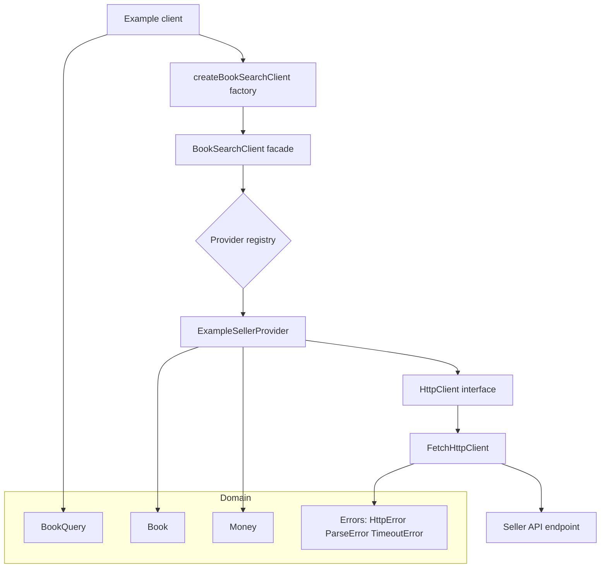
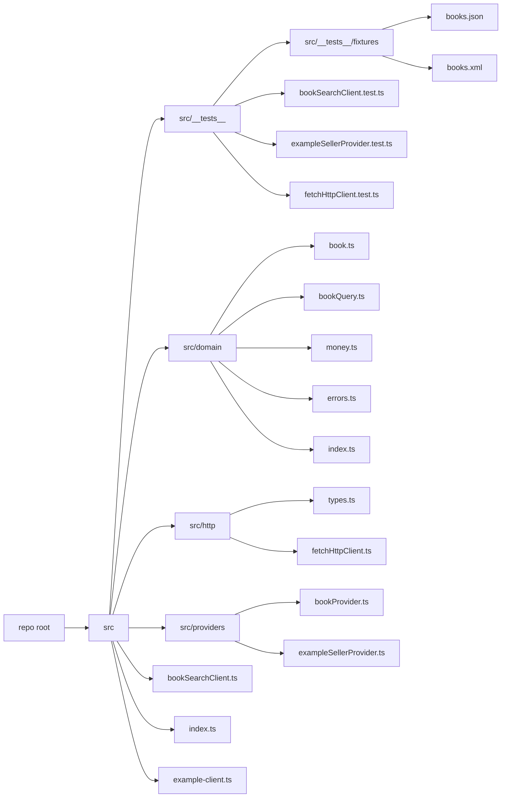

# Javascript Code Test

`BookSearchApiClient` is a simple class that makes a call to a http API to retrieve a list of books and return them.

You need to refactor the `BookSearchApiClient` class, and demonstrate in `example-client.js` how it would be used. Refactor to what you consider to be production ready code. You can change it in anyway you would like and can use javascript or typescript.

Things you will be asked about:

1. How could you easily add other book seller APIs in the the future
2. How would you manage differences in response payloads between different APIs without needing to make future changes to whatever code you have in example-client.js
3. How would you implement different query types for example: by publisher, by year published etc
4. How your code would be tested

# My approach

## User Stories

### As a consumer of the client

- I want to search for books by author so that I can retrieve a list of matching books.
- I want to search by publisher or by year published so that the query API is extensible beyond just author searches.
- I want the search results returned in a consistent shape (`Book`) so that my code does not depend on vendor specific payloads.
- I want the client to fail fast and clearly when configuration is missing (for example base URL) so I do not accidentally call the wrong endpoint.

### As a maintainer

- I want to add a new book seller API by implementing a new provider so that I can extend the system without changing consumer code.
- I want payload differences (JSON vs XML, different field names) handled inside providers so that consumers remain stable.
- I want a clear separation of concerns (domain, http, providers, facade) so the code remains readable and maintainable.
- I want fast, deterministic tests that do not depend on real network calls so refactors are safe and feedback is quick.

### Goals

I refactored the original client into a small, production ready design with these goals:

- Easy to add new book seller APIs without changing consumer code
- Normalise different payloads into a single domain model
- Support multiple query types in a type safe way
- Make the code straightforward to test

### High level design

The refactor is organised into a few layers:

- Domain: stable contract (`Book`, `Money`, `BookQuery`)
- HTTP: `HttpClient` abstraction (`FetchHttpClient`) with timeouts and consistent errors
- Providers: one per seller (`BookProvider`, `ExampleSellerProvider`) mapping payloads to `Book`
- Facade: `BookSearchClient` is the single entry point for consumers
- Factory: `createBookSearchClient` wires defaults in one place

### 1 Adding more book seller APIs

Add a new provider that implements `BookProvider`, then register it.

Provider skeleton:

```ts
import type { Book, BookQuery } from './domain';
import type { BookProvider } from './providers/bookProvider';

export class AnotherSellerProvider implements BookProvider {
  async search(_query: BookQuery): Promise<Book[]> {
    return [];
  }
}
```

Register providers:

```ts
import { BookSearchClient } from './bookSearchClient';

const client = new BookSearchClient(
  { exampleSeller: exampleProvider, anotherSeller: anotherProvider },
  { defaultProvider: 'exampleSeller' },
);
```

### 2 Handling different response payloads without changing the example client

Each provider normalises its own payload into the same domain shape:

- `Book` (title, author, isbn, quantity, price as `Money`)

So the consumer does not care if the seller returns JSON or XML.

Consumer stays the same:

```ts
await client.search({
  type: 'byAuthor',
  author: 'Shakespeare',
  limit: 10,
});
```

### 3 Supporting different query types

Queries are modelled as a discriminated union `BookQuery`:

- byAuthor
- byPublisher
- byYearPublished

Adding a new query type is:

- Add a new union case in BookQuery
- Add provider mapping logic for that case

Example usage:

```ts
await client.search({ type: 'byAuthor', author: 'Shakespeare', limit: 10 });

await client.search({
  type: 'byPublisher',
  publisher: 'Penguin',
  limit: 10,
});

await client.search({
  type: 'byYearPublished',
  year: 1603,
  limit: 10,
});
```

### 4 Testing strategy

Testing follows a simple pyramid:

- **Unit tests**: provider mapping for JSON and XML using fixtures, plus HTTP error and timeout behaviour
- **Integration style tests**: `BookSearchClient` delegation to providers

This keeps tests fast, deterministic, and independent of real network calls.

### How to run

#### Install

```bash
npm install
```

#### Configuration

This project expects a base URL for the seller API. You must either:

- Set `BOOK_API_BASE_URL`, or
- Pass `baseUrl` to `createBookSearchClient`.

Local and production examples are managed via env files:

- Copy `.env.example` to `.env.local` for local development
- Copy `.env.example` to `.env.production` and replace the URL for a production environment

#### Commands:

- Typecheck: `npm run typecheck`
- Tests: `npm run test`

#### Example usage:

- Local: `npm run example:local` (uses `.env.local`)
- Production like: `npm run example:prod` (uses `.env.production`)
- Manual: `BOOK_API_BASE_URL=http://localhost:3000 npm run example`

#### Local smoke run (optional)

1. Start a local mock API (any API that matches the expected payload shape)
2. Ensure `.env.local` contains `BOOK_API_BASE_URL=http://localhost:3000`
3. Run: `npm run example:local`

#### Example:

- `.env.local -> BOOK_API_BASE_URL=http://localhost:3000`
- `npm run example:local`

### Architecture diagram



### Code Structure



## Future improvements

- Provider selection strategy
  - Support multiple registered providers in `createBookSearchClient` and select by name, region, availability, or feature support.
  - Optional fallback strategy if a provider is down.

- Stronger validation
  - Add stricter domain validation rules (for example ISBN format checks, quantity bounds).
  - If a seller publishes a formal schema (XSD or similar), validate XML responses against it before mapping.

- Better XML mapping robustness
  - Make XML parsing more schema aware (or explicitly scoped to known parent elements) to avoid accidental matches in nested structures.

- Observability and resilience
  - Add structured logging hooks and request ids for easier debugging.
  - Optional retries with backoff for transient network errors.

- Packaging and distribution
  - Add a proper build step to emit `dist` output and type declarations for publishing as a library.
  - Document the supported Node versions and provide a minimal API reference section.
